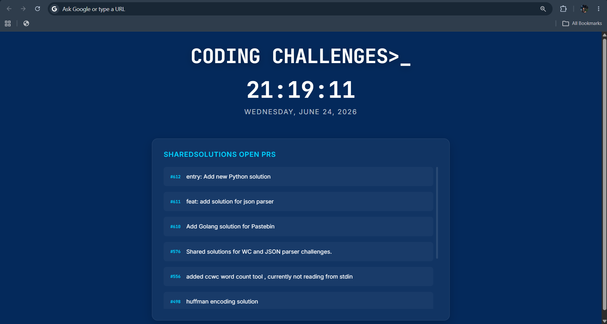

# Coding Challenges Dashboard

A Chrome Extension that replaces the default Chrome New Tab page with a Coding Challenges themed dashboard featuring a live clock, current date, and real-time GitHub pull request tracking.

## Preview



---

## Features

- Live updating digital clock
- Human-readable date display
- Real-time GitHub Pull Request feed
- Coding Challenges inspired design
- Responsive layout
- Manifest V3 compliant

---

## Technologies Used

- HTML5
- CSS3
- JavaScript (ES Modules)
- Chrome Extensions Manifest V3
- GitHub REST API

---

## Project Structure

```text
coding-challenges-dashboard/
│
├── assets/
│   └── dashboard-preview.png
│
├── manifest.json
├── newtab.html
├── styles.css
├── main.js
├── api.js
├── time.js
├── .gitignore
└── README.md
```

---

## Installation

### Load Extension Locally

1. Clone the repository

```bash
git clone https://github.com/securematrix/coding-challenges-dashboard.git
```

2. Open Chrome Extensions

```text
chrome://extensions
```

3. Enable **Developer Mode**

4. Click **Load unpacked**

5. Select the project folder

6. Open a new tab

The Coding Challenges Dashboard will replace the default Chrome New Tab page.

---

## GitHub Integration

The extension retrieves open pull requests from:

https://api.github.com/repos/CodingChallegesFYI/SharedSolutions/pulls

Displayed information includes:

- Pull Request Number
- Pull Request Title
- Direct Link to GitHub

---

## Future Improvements

- GitHub API caching
- Weather widget
- Daily coding quote
- User customization options
- Theme switching
- Challenge feed integration

---

## License

This project is open source and available under the MIT License.
